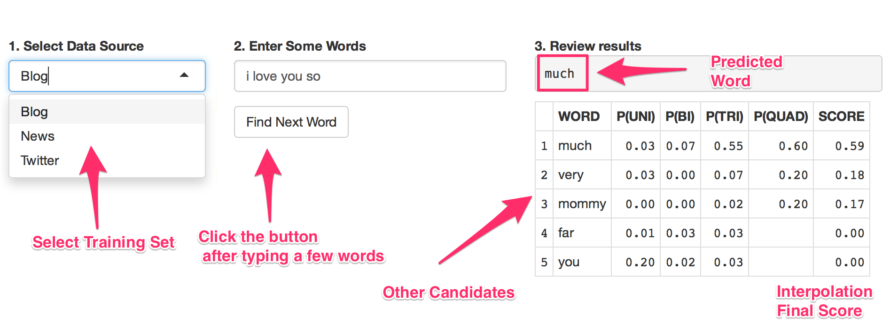

Word Prediction Demo
========================================================
author: Kiichi Takeuchi
date: April 26, 2015

Background and Motivation
========================================================

Word Prediction is one of the most important text mining techniques in order to speed up user's input process. In limited User Interface environment, such as smartphone application, predicting next word is key feature of the platform because the keyboard size and functionalities are limited; users will get huge benefit by saving keystroke.

The goal of this project is to build an app that takes user input, and display predicted word. Additionally, the user can select a specific data source from three different corpora: Blog, News and Twitter, and the other candidates of predicted words are displayed with the final score.

Data Set
========================================================

In this demo, you can choose one of three data sources: Twitter, Blog and News.

Each file has been preprocessed:

1. Read original text file into memory.
1. Take 5% sample from the entire set.
1. Apply profanity filter.
1. Using N-Gram Tokenizer to build unigram, bigram, trigram, and quadgram.
1. Build frequency tables for each token so that it's ready to calculate the probability of occuring in each N-Gram based on Markov Assumption (See next slide)

Model and Smoothing
========================================================

The demo is calculating the probability of next word based on preceding words using Markov assumption.

Four major options are examined for this demo: 

* Lapsace 
* Back-off
* Interpolation
* Kneser-Ney

I decided to implement interpolation smoothing since it's fast to compute, and it's giving reasonable results. Additionally, some weight from the Kneser-Ney smoothing are blended from lower order of grams.

Demo
========================================================

https://kiichi.shinyapps.io/product/

Try: "San","I love you so", etc... Also type "Thanks for", and switch between Blog and Twitter. See "following" v.s. "reading" in the ranking?

Future Work
========================================================

A quick improvement could be implemented by using the current user's input history. In Shiny App, user specific session data is available, and this could be useful to store the history data per user. The user corpus should provide more weight on top of the general frequency table.

I would definitely consider to implement Generalized Language Model (GLM) since it'll be add-on improvement by creating another corpus. This clould be done by replacing sparse words with <UNK> symbol, and aggregate frequency after masking them in existing n-gram dataset.

Also, I would spend time to speed up and minize the storage size for the corpus. I can think of better data structure, such as [trie](http://en.wikipedia.org/wiki/Trie), which is based on O(Log) efficiency.

