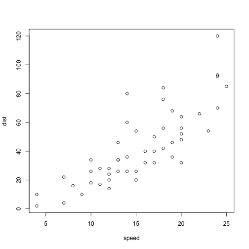

Word Prediction
========================================================
author: Kiichi Takeuchi
date: April 26, 2015

Background
========================================================

Word Prediction is important text mining technique in order to speed up user's input. Especially, it's important on smartphone application because the keyboard functionalities and space are limited. The goal of this project is to build an app that takes user input text, and display predicted words next to it.

Data
========================================================

In this demo, you can choose one of three data sources: Twitter, Blog and News.
Each file has been imported and files are processed into unigram, bigram and trigram tables.

Model
========================================================

 

Conclusion
========================================================
